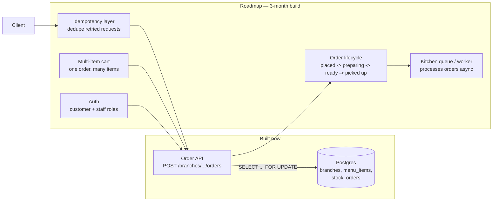

# KFSuay POS — Design

## Problem

A point-of-sale system for a multi-branch restaurant chain. Each branch
holds its own stock of each menu item. Customers place orders concurrently
(app, kiosk, counter) against the same branch's stock at the same time.

The naive implementation — read the stock count, check it, write the
decremented value back — has a race: two requests can both read "1 left",
both decide it's available, and both succeed. Stock goes negative, and the
kitchen has promised food it doesn't have.

## What this repo builds (the slice)

One endpoint that solves that race for a single branch/item pair:

```
POST /branches/{branch_id}/orders
{ "item_id": <int>, "quantity": <int> }
```

Inside a single Postgres transaction:

1. `SELECT quantity_available ... FOR UPDATE` — locks that stock row so no
   other transaction can read or modify it until this one commits or
   rolls back.
2. Check the requested quantity against the locked value.
3. If it fits: decrement stock, insert the order, commit → `200`.
4. If it doesn't: roll back, return `409`.

`FOR UPDATE` was chosen over optimistic concurrency (version column +
retry) because contention here is expected and short-lived (a handful of
concurrent orders on a popular item, not thousands) — a short row lock is
simpler to reason about and cheaper than an app-level retry loop for that
scale. Optimistic locking would be worth revisiting if a single item
regularly saw very high concurrent write contention.

`demo_concurrency.py` proves this: it fires 30 concurrent single-unit
orders at a branch/item seeded with 10 units, and asserts exactly 10
succeed, the rest get a clean `409`, and the DB's final stock is exactly 0
— never negative, never oversold.

## What this repo does not build yet

This is a slice of a larger POS, sketched below. Everything past the
inventory-locking core is roadmap, not implementation:



- **Idempotency** — a retried request (flaky network, double-tap) must not
  place two orders. Planned approach: client-supplied idempotency key,
  unique-constrained in the DB; a repeated key returns the original
  order instead of creating a new one.
- **Order lifecycle** — right now an order is just a row. A real POS needs
  state (`placed → preparing → ready → picked_up`) and a way for the
  kitchen to move orders through it, likely via a background worker
  and a status the client can poll.
- **Multi-item cart** — a real order is several items in one transaction,
  not one item per request. The locking approach extends (lock all rows
  needed for the cart, in a consistent order to avoid deadlock) but
  wasn't necessary to prove the core race-condition fix.
- **Auth** — no login, no staff/customer distinction yet; anyone can hit
  the endpoint. Fine for a local demo, not for anything real.

## Why Postgres + raw psycopg over an ORM

The entire point of this slice is the transaction and the row lock — those
should be visible in the code, not hidden behind ORM session/unit-of-work
machinery. Raw SQL via `psycopg` keeps the `FOR UPDATE` and the
transaction boundary in plain sight in one function
(`main.py::place_order`). An ORM would be worth it once the schema and
query surface grow past what fits in a page.

## Origin

The domain (menu, branches) is carried over from an earlier solo CS
coursework CLI (`CS Final.py`, a console-based KFSuay ordering app) —
reused here for its data shape only. This repo is a from-scratch rebuild
around a real backend problem (concurrent inventory), not a port of that
code.
